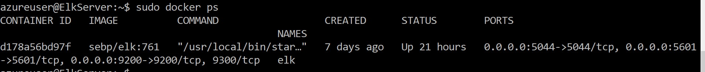

##CyberSecurity Project

## Table of Contents
* [Automated ElK Stack Deployment](#general-information)
	*[Ansible] (#all ansible documents) 	
* [Description of the Topology](#topology-used)
* [Access Policies](#features)
* [Elk Configuration](#screenshots)
* [Target Machines & Beats](#setup)
* [Steps to set up ELK server](#usage)
* [Steps to Installing filebeat](#project-status)
* [Steps to Installing metricbeat](#room-for-improvement)
* [Linux Bash Scripts](#acknowledgements)
* [ADDITONAL NOTES:(#TBD)
<!-- * [License](#license) -->

- The files in this repository were used to configure the network depicted below.

-Diagram

<!-- If you have screenshots you'd like to share, include them here. -->


## Automated ELK Stack Deployment

These files have been tested and used to generate a live ELK deployment on Azure. They can be used to either recreate the entire deployment pictured above. Alternatively, select portions of the yaml and config file may be used to install only certain pieces of it, such as Filebeat.

- [Ansible Playbook](https://github.com/kinpelaa/CyberSecurity-Projects/blob/master/Ansible/my-playbook1.yml)
- [Ansible Hosts](https://github.com/kinipelaa/CybperSecurity-Projects-/blob/0b9af35307320d7ebe72e41383ee2f4906c33378/Ansible/hosts)
- [Ansible Configuration](https://github.com/kinipelaa/CybperSecurity-Projects-/blob/0b9af35307320d7ebe72e41383ee2f4906c33378/Ansible/ansible.cfg)
- [Ansible ELK Installation and VM Configuration](https://github.com/kinipelaa/CybperSecurity-Projects-/blob/0b9af35307320d7ebe72e41383ee2f4906c33378/Ansible/install-elk.yml) 
- [Ansible Filebeat Playbook](https://github.com/kinipelaa/CybperSecurity-Projects-/blob/0b9af35307320d7ebe72e41383ee2f4906c33378/Ansible/filebeat-playbook.yml)
- [Ansible Filebeat Config file](https://github.com/kinipelaa/CybperSecurity-Projects-/blob/0b9af35307320d7ebe72e41383ee2f4906c33378/Ansible/filebeat-config.yml)
- [Ansible Metricbeat Playbook](https://github.com/kinipelaa/CybperSecurity-Projects-/blob/0b9af35307320d7ebe72e41383ee2f4906c33378/Ansible/metricbeat-paybook.yml)
- [Ansible Metricbeat Config file](https://github.com/kinipelaa/CybperSecurity-Projects-/blob/0b9af35307320d7ebe72e41383ee2f4906c33378/Ansible/metricbeat-config.yml)

This document contains the following details:
- Description of the Topologu
- Access Policies
- ELK Configuration
  - Beats in Use
  - Machines Being Monitored
- How to Use the Ansible Build


### Description of the Topology

The main purpose of this network is to expose a load-balanced and monitored instance of DVWA, the D*mn Vulnerable Web Application.

Load balancing ensures that the application will be highly available, in addition to restricting access to the network.

- What aspect of security do load balancers protect? 
-Answer: Availability, Web Traffic, Web Security

 - What is the advantage of a jump box?
 - Answer: Automation, Security, Network Segmentation, Access Control
Secure computer for users who have elevated privileges which allows them to perform task that requires administrator access or require them to connect to another server.

Integrating an ELK server allows users to easily monitor the vulnerable VMs for changes to the data and system logs.

- What does Filebeat watch for?It monitors the log files collects log events and forwards it to the either Elasticsearch or Logstash for indexing. 

- What does Metricbeat record? Monitor your servers by collecting metrics from the system and services running on the server, such as: Apache.

The configuration details of each machine may be found below.
_Note: Use the [Markdown Table Generator](http://www.tablesgenerator.com/markdown_tables) to add/remove values from the table_.

| Name     | Function | IP Address | Operating System |
|----------|----------|------------|------------------|
| Jump Box | Gateway  |10.1.0.4/20.119.33.182| Linux |
| Web-1    |Web Server| 10.1.0.5   | Linux            |
| Web-2    |Web Server| 10.1.0.6   | Linux            |    
| LB       |Load Balancing| Static External IP| Linux |
|Elk Server|Monitoring| 10.2.0.4   | Linux            |

### Access Policies

The machines on the internal network are not exposed to the public Internet. 

Only the Jump-Box-Provisioner machine can accept connections from the Internet. Access to this machine is only allowed from the following IP addresses:
- _Workstation Public IP through TCP 5601. Also whitelisted IP addresses Personal IP "WORKSTATION" 

- Jump-Box-Provisioner IP : 10.0.0.4 via SSH port 22
- Workstation Public IP via port TCP 5601

Machines within the network can only be accessed by Jump-Box-Provisioner.
- Which machine did you allow to access your ELK VM? What was its IP address?_The ELK-Server is only accessible by SSH from the Jump-Box-Provisioner and through web access from personal workstation. 

A summary of the access policies in place can be found in the table below.

| Name     | Publicly Accessible | Allowed IP Addresses                 |
|----------|---------------------|--------------------------------------|
| Jump Box | Yes              	 |  Workstation Public IP 99.110.222.198|
| Web-1    | No                  |  10.1.0.5 on SSH 22                  |
| Web-2    | No                  |  10.1.0.6 on SSH 22                  |
|Elk-Server| No                  |  Workstation Public IP using TCP 5601|

### Elk Configuration

Ansible was used to automate configuration of the ELK machine. No configuration was performed manually, which is advantageous because..._Ansible lets you quickly and easily deploy multitier apps. You won't need to write custom code to automate your systems; you list the tasks required to be done by writing a playbook, and Ansible will figure out how to get your systems to the state you want them to be in._
 - What is the main advantage of automating configuration with Ansible?
Ansible lets you quickly and easily deploy multitier apps. You won't need to write custom code to automate your systems; you list the tasks 
required to be done by writing a playbook, and Ansible will figure out how to get your systems to the state you want them to be in.
Free: Ansible is an open-source tool.
Very simple to set up and use: No special coding skills are necessary to use Ansible’s playbooks. 
Powerful: Ansible lets you model even highly complex IT workflows.
Flexible: You can orchestrate the entire application environment no matter where it’s deployed. You can also customize it based on your needs.
Agentless: You don’t need to install any other software or firewall ports on the client systems you want to automate. You also don’t have to set up a separate management structure.
Efficient: Because you don’t need to install any extra software, there’s more room for application resources on your server.

The playbook implements the following tasks:
- ...Install docker.io
- ...Install pip3
- ...Install Docker python module
- ...Increase virtual memory
- ...Download and launch a docker
- ...

- Installs docker.io, pip and the docker module
  - name: Install docker.io
    apt:
      update_cache: yes
      name: docker.io
      state: present

  - name: Install pip3
    apt:
      force_apt_get: yes
      name: python3-pip
      state: present

  - name: Install Docker python module
    pip:
      name: docker
      state: present

- Specify a different group of machines as well as a different remote user 
    ```bash
      - name: Config elk VM with Docker
        hosts: elk
        remote_user: sysadmin
        become: true
        tasks:
    ``` 
- Increase System Memory :
    ```yaml
     - name: Use more memory
      sysctl:
        name: vm.max_map_count
        value: '262144'
        state: present
        reload: yes
    ```
- Install the following services:
    ```bash
       `docker.io`
       `python3-pip`
       `docker`, which is the Docker Python pip module.
    ``` 
- Launching and Exposing the container with these published ports:
    ```bash
     `5601:5601` 
     `9200:9200`
     `5044:5044`
    ```

The following screenshot displays the result of running `docker ps` after successfully configuring the ELK instance.



### Target Machines & Beats
This ELK server is configured to monitor the following machines:
- _List the IP addresses of the machines you are monitoring_

Name	IP Addresses
- Web-1	10.1.0.5
- Web-2	10.1.0.6

We have installed the following Beats on these machines:

- ELK Server, 
- Web1  
- Web2

- The ELK Stack Installed are: 
  - Filebeat
  - Metricbeat

These Beats allow us to collect the following information from each machine:
- Filebeat - collects data about the file system, log events. 
- Metricbeat - collects machine metrics and system statistics, such as uptime

### Using the Playbook
In order to use the playbook, you will need to have an Ansible control node already configured. Assuming you have such a control node provisioned: 

SSH into the control node and follow the steps below:
- Copy the playbook file to Ansible Control Node.
- Update the host file to include webserver and elk: /etc/ansible/hosts

# This is the default ansible 'hosts' file.
#
# It should live in /etc/ansible/hosts
#
#   - Comments begin with the '#' character
#   - Blank lines are ignored
#   - Groups of hosts are delimited by [header] elements
#   - You can enter hostnames or ip addresses
#   - A hostname/IP can be a member of multiple groups
# You need only a [webservers] and [elkservers] group.
# List the IP Addresses of your webservers
# You should have at least 2 IP addresses
[webservers]
10.0.0.4 ansible_python_interpreter=/usr/bin/python3
10.0.0.8 ansible_python_interpreter=/usr/bin/python3
10.0.0.9 ansible_python_interpreter=/usr/bin/python3
# List the IP address of your ELK server
# There should only be one IP address
[elk]
10.1.0.4 ansible_python_interpreter=/usr/bin/python3

- Run the playbook, and navigate to Kibana (http://my.ELK-VMExternal.IP:5601/app/kibana#/home to check that the installation worked as expected.

 - Run playbook using this command : ansible-playbook filebeat-playbook.yml
_
- _Which file is the playbook? Where do you copy it?_
  - Answer: For the ANSIBLE : We will create the my-playbook1.yml as our playbook.Playbooks are the files where Ansible code is written. Playbooks are written in YML 

See the final solution of the [Ansible Playbook](https://github.com/kinpelaa/CyberSecurity Project/blob/master/Ansible/my-playbook1.yml)

  Answer : For FILEBEAT: We will create filbeat-playbook.yml as our playbook.
  Answer: For METRICBEAT: We will create metricbeat-playbook.yml as our playbook.
 
- _Which file do you update to make Ansible run the playbook on a specific machine? 

- root@c1e0a059c0b0:/etc/ansible# curl -L -O https://ansible.com/  > ansible.cfg
- root@c1e0a059c0b0:/etc/ansible# nano ansible.cfg

- Press CTRL + W (to search > enter remote_user then change `remote_user = sysadmin`
Where : `sysadmin` is the remote user that has control over ansible.

  
---How do I specify which machine to install the ELK server on versus which to install Filebeat on?_ 
 
Answer:Edit the Ansible Hosts file in this directory /etc/ansible/hosts

- _Which URL do you navigate to in order to check that the ELK server is running?
Answer:  Test Kibana on web : http://[your.ELK-VM.External.IP]:5601/app/kibana

_As a **Bonus**, provide the specific commands the user will need to run to download the playbook, update the files, etc._
 - Run: ansible-playbook my_playbook.yml
 - Download: curl -L -O 
 - Update: nano "playbook name" 
